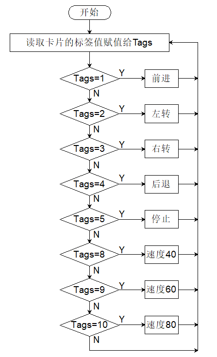

# 5.2 交通卡片控制小车

## 5.2.1 简介

交通卡片控制小车，卡片有前进，左转，右转，掉头，停止，速度40，速度60，速度80，红灯，绿灯，AI视觉模块进行识别交通卡片，通过对应的卡片使小车进行相应的动作。

## 5.2.2 流程图



## 5.2.3 代码

```c
#include <Arduino.h>  // Arduino核心库
#include <Sentry.h>   // Sentry机器视觉传感器库

// 为Sengo2类型创建别名"Sengo"，简化后续使用
typedef Sengo2 Sengo;

// 定义通信方式（当前启用I2C）
#define SENGO_I2C
// #define SENGO_UART          // UART串口通信方案（已注释禁用）

// 根据选择的通信方式包含相应库
#ifdef SENGO_I2C
#include <Wire.h>  // I2C通信所需库
#endif

#ifdef SENGO_UART
#include <SoftwareSerial.h>               // 软串口库
#define TX_PIN 11                         // 自定义TX引脚号
#define RX_PIN 10                         // 自定义RX引脚号
SoftwareSerial mySerial(RX_PIN, TX_PIN);  // 创建软串口对象
#endif

#define ML 33
#define ML_PWM 26
#define MR 32
#define MR_PWM 25

#define BUZZER_PIN 3

int left_speed = 255;
int right_speed = 255;

int Tags = 0;

// 定义视觉处理类型为卡片识别模式
#define VISION_TYPE Sengo::kVisionCard

// 创建Sengo传感器对象实例
Sengo sengo;

// 卡片类型名称映射表（索引对应卡片标签值）
const char* card_classes[] = {
  "unknown",      // 0: 未知卡片类型
  "forward",      // 1: 前进卡片
  "left",         // 2: 左转卡片
  "right",        // 3: 右转卡片
  "turn_around",  // 4: 掉头卡片
  "park",         // 5: 停车卡片
  // 注意：数组大小应与实际卡片类型数量匹配
};


void setup() {
  sentry_err_t err = SENTRY_OK;  // 定义错误状态变量，初始化为无错误

  Serial.begin(9600);                                 // 初始化串口通信，波特率9600
  Serial.println("Waiting for sengo initialize...");  // 打印初始化提示

// 根据选择的通信方式初始化传感器
#ifdef SENGO_I2C
  Wire.begin();  // 初始化I2C总线
  // 循环尝试连接传感器，直到成功
  while (SENTRY_OK != sengo.begin(&Wire)) {
    yield();  // 在等待连接期间允许系统处理其他任务
  }
#endif  // SENGO_I2C

#ifdef SENGO_UART
  mySerial.begin(9600);  // 初始化软串口，波特率9600
  // 循环尝试连接传感器，直到成功
  while (SENTRY_OK != sengo.begin(&mySerial)) {
    yield();  // 在等待连接期间允许系统处理其他任务
  }
#endif  // SENGO_UART

  Serial.println("Sengo begin Success.");  // 打印传感器初始化成功信息

  // 启动卡片视觉识别功能
  err = sengo.VisionBegin(VISION_TYPE);

  // 打印视觉识别初始化结果
  Serial.print("sengo.VisionBegin(kVisionCard) ");
  if (err) {
    Serial.print("Error: 0x");  // 如果出错，打印错误前缀
  } else {
    Serial.print("Success: 0x");  // 如果成功，打印成功前缀
  }
  Serial.println(err, HEX);  // 以16进制格式打印错误代码

  pinMode(ML, OUTPUT);      //设置左电机方向控制引脚为输出
  pinMode(ML_PWM, OUTPUT);  //设置左电机方向控制引脚为输出
  pinMode(MR, OUTPUT);      //设置左电机方向控制引脚为输出
  pinMode(MR_PWM, OUTPUT);  //设置左电机方向控制引脚为输出

  pinMode(BUZZER_PIN, OUTPUT);
}

void loop() {
  // 获取检测到的卡片数量（kStatus参数返回检测到的对象总数）
  int obj_num = sengo.GetValue(VISION_TYPE, kStatus);

  // 如果检测到至少一张卡片
  if (obj_num > 0) {
    // 遍历所有检测到的卡片
    for (int i = 1; i <= obj_num; ++i) {
      // 获取卡片类型标签（对应card_classes数组索引）
      Tags = sengo.GetValue(VISION_TYPE, kLabel, i);
      // 打印卡片详细信息
      Serial.print("  Tags:");
      Serial.println(Tags);
    }
    switch (Tags) {
      case 1: car_forward(); break;
      case 2: car_left(); break;
      case 3: car_right(); break;
      case 4: car_back(); break;
      case 5: car_stop(); break;
      case 8: speed_40(); break;
      case 9: speed_60(); break;
      case 10: speed_80(); break;
    }
  } else {
    car_stop();
  }
  delay(200);
}

//设置小车速度为全速的40%
void speed_40() {
  buzzer_play(102);
  left_speed = 255 * 0.4;
  right_speed = 255 * 0.4;
}

//设置小车速度为全速的60%
void speed_60() {
  buzzer_play(153);
  left_speed = 255 * 0.6;
  right_speed = 255 * 0.6;
}

//设置小车速度为全速的80%
void speed_80() {
    buzzer_play(204);
  left_speed = 255 * 0.8;
  right_speed = 255 * 0.8;
}

void buzzer_play(int speed) {
  if (left_speed != speed) {
    // 播放短促的"哔"声
    tone(BUZZER_PIN, 1000, 100);  // 1000Hz频率，持续100ms
    delay(100);
    noTone(BUZZER_PIN);
  }
}

//小车前进代码
void car_forward() {
  digitalWrite(ML, LOW);
  analogWrite(ML_PWM, left_speed);
  digitalWrite(MR, LOW);
  analogWrite(MR_PWM, right_speed);
}

//小车后退代码
void car_back() {
  digitalWrite(ML, HIGH);
  analogWrite(ML_PWM, (255 - left_speed));
  digitalWrite(MR, HIGH);
  analogWrite(MR_PWM, (255 - right_speed));
}

//小车左转代码
void car_left() {
  digitalWrite(ML, HIGH);
  analogWrite(ML_PWM, 127);
  digitalWrite(MR, LOW);
  analogWrite(MR_PWM, 127);
}

//小车右转代码
void car_right() {
  digitalWrite(ML, LOW);
  analogWrite(ML_PWM, 127);
  digitalWrite(MR, HIGH);
  analogWrite(MR_PWM, 127);
}

//小车停止代码
void car_stop() {
  digitalWrite(ML, LOW);
  analogWrite(ML_PWM, 0);
  digitalWrite(MR, LOW);
  analogWrite(MR_PWM, 0);
}

```

## 5.2.4 代码结果

上传代码成功后，AI视觉模块会对拍到的画面进行识别，判断是否有交通卡片，如果有则想卡片的标签值赋值到变量Tags，通过对变量Tags的值进行判断，Tags = 1 小车前进，Tags = 2 小车左转 ，Tags = 3 小车右转 ，Tags = 4 小车后退 ，Tags = 5 小车停止 ，Tags = 8 小车速度设置为全速（255）的40% ， Tags = 9 小车速度设置为全速（255）的60% ，Tags = 10 小车速度设置为全速（255）的80%。（注意：只有要设置的速度与当前速度不一致时才会发出“滴”的声音）

