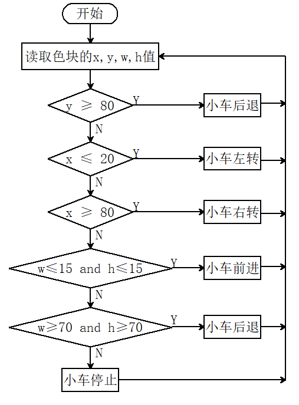

# 5.3 色块追踪小车

## 5.3.1 简介

色块追踪小车，AI视觉模块对色块进行锁定并且根据AI视觉模块给出的色块XY以及宽高进行左右前后的跟踪。

## 5.3.2 流程图



## 5.3.3 代码

```c
#include <Arduino.h>
#include <Sentry.h>

typedef Sengo2 Sengo;

#define SENGO_I2C
// #define SENGO_UART

#ifdef SENGO_I2C
#include <Wire.h>
#endif
#ifdef SENGO_UART
#include <SoftwareSerial.h>
#define TX_PIN 11
#define RX_PIN 10
SoftwareSerial mySerial(RX_PIN, TX_PIN);
#endif

#define VISION_TYPE Sengo::kVisionBlob
Sengo sengo;

const char* blob_classes[] = {
  "UNKNOWN", "BLACK", "WHITE", "RED", "GREEN", "BLUE", "YELLOW"
};

int x, y, w, h;

#define ML 33
#define ML_PWM 26
#define MR 32
#define MR_PWM 25

void setup() {
  sentry_err_t err = SENTRY_OK;

  Serial.begin(9600);

  Serial.println("Waiting for sengo initialize...");
#ifdef SENGO_I2C
  Wire.begin();
  while (SENTRY_OK != sengo.begin(&Wire)) { yield(); }
#endif  // SENGO_I2C
#ifdef SENGO_UART
  mySerial.begin(9600);
  while (SENTRY_OK != sengo.begin(&mySerial)) { yield(); }
#endif  // SENGO_UART
  Serial.println("Sengo begin Success.");
  sengo.SetParamNum(VISION_TYPE, 1);
  sentry_object_t param = { 0 };
  /* Set minimum blob size(pixel) */
  param.width = 5;
  param.height = 5;
  /* Set blob1 color */
  param.label = Sengo::kColorRed;
  err = sengo.SetParam(VISION_TYPE, &param, 1);
  Serial.print("sengo.SetParam[");
  Serial.print(blob_classes[param.label]);
  if (err) {
    Serial.print("] Error: 0x");
  } else {
    Serial.print("] Success: 0x");
  }
  Serial.println(err, HEX);

  /* Set per blob max number */
  err = sengo.VisionSetMode(VISION_TYPE, 1);
  Serial.print("sengo.VisionSetMode");
  if (err) {
    Serial.print(" Error: 0x");
  } else {
    Serial.print(" Success: 0x");
  }
  Serial.println(err, HEX);
  err = sengo.VisionBegin(VISION_TYPE);
  Serial.print("sengo.VisionBegin(kVisionBlob) ");
  if (err) {
    Serial.print("Error: 0x");
  } else {
    Serial.print("Success: 0x");
  }
  Serial.println(err, HEX);

  pinMode(ML, OUTPUT);      //设置左电机方向控制引脚为输出
  pinMode(ML_PWM, OUTPUT);  //设置左电机方向控制引脚为输出
  pinMode(MR, OUTPUT);      //设置左电机方向控制引脚为输出
  pinMode(MR_PWM, OUTPUT);  //设置左电机方向控制引脚为输出
}

void loop() {
  int obj_num = sengo.GetValue(VISION_TYPE, kStatus);
  if (obj_num) {
    for (int i = 1; i <= obj_num; ++i) {
      x = sengo.GetValue(VISION_TYPE, kXValue, i);
      y = sengo.GetValue(VISION_TYPE, kYValue, i);
      w = sengo.GetValue(VISION_TYPE, kWidthValue, i);
      h = sengo.GetValue(VISION_TYPE, kHeightValue, i);
    }
 
    if (y >= 80) {
      //小车后退
      car_back();
    } else if (x <= 20) {
      //小车左转
      car_left();
    } else if (x >= 80) {
      //小车右转
      car_right();
    } else if (w <= 25 && h <= 25) {
      car_forward();
    } else if (w >= 70 && h >= 70) {
      car_back();
    } else {
      car_stop();
    }
  } else {
    car_stop();
  }
}


//小车前进代码
void car_forward() {
  digitalWrite(ML, LOW);
  analogWrite(ML_PWM, 100);
  digitalWrite(MR, LOW);
  analogWrite(MR_PWM, 100);
}

//小车后退代码
void car_back() {
  digitalWrite(ML, HIGH);
  analogWrite(ML_PWM, 150);
  digitalWrite(MR, HIGH);
  analogWrite(MR_PWM, 150);
}

//小车左转代码
void car_left() {
  digitalWrite(ML, HIGH);
  analogWrite(ML_PWM, 165);
  digitalWrite(MR, LOW);
  analogWrite(MR_PWM, 90);
}

//小车右转代码
void car_right() {
  digitalWrite(ML, LOW);
  analogWrite(ML_PWM, 90);
  digitalWrite(MR, HIGH);
  analogWrite(MR_PWM, 165);
}

//小车停止代码
void car_stop() {
  digitalWrite(ML, LOW);
  analogWrite(ML_PWM, 0);
  digitalWrite(MR, LOW);
  analogWrite(MR_PWM, 0);
}

```

## 5.3.4 代码结果

上传代码成功后，AI视觉模块会对拍到的画面进行识别，判断是否有红色块，如果有红色块便从这个色块的x，y，w，h值上判断小车的动作，比如红色块靠显示屏的右边小车便往右边转动，红色快靠左小车就往左边转到，红色快靠下小车就后退。（使用我们提供的颜色卡片）

