# 3.1 Arduino IDE 简介

Arduino IDE是一款专为Arduino硬件设计的集成开发环境，它以初学者友好的界面和强大的开源代码支持而闻名。这款工具不仅简化了编程过程，降低了开发门槛，还为初学者提供了一个易于上手的学习平台。

Arduino IDE拥有简洁直观的用户界面，支持语法高亮、自动完成等功能，使得编程过程变得轻松愉快。更重要的是，它基于开放源代码，这意味着用户可以自由访问、修改和分发代码，从而大大扩展了开发的可能性。

对于初学者来说，Arduino IDE提供了丰富的教程、示例代码和社区支持，帮助他们快速上手并解决实际问题。同时，开源代码的特性也意味着用户可以借鉴和学习他人的代码，加速自己的学习进程。

总之，Arduino IDE以其初学者友好的界面和强大的开源代码支持，成为了Arduino开发者不可或缺的工具之一，无论是初学者还是专业人士，都能从中受益。

# 3.2  Windows 系统

**特别提醒：本教程采用的 Arduino IDE 版本是 2.3.6 。如果是其他版本的话，不能保证本教程提供的示例代码能编译和上传成功。** 

## 3.3.1 Arduino IDE下载 

我们先到Arduino官方的网站：[Software | Arduino](https://www.arduino.cc/en/software/) 下载 Arduino IDE。

Arduino 软件有很多版本，有Windows，Mac，Linux系统的（如下图），而且还有过去老的版本，你只需要下载一个适合自己计算机系统的版本即可。

这里是以下载 **Windows Win 10 or newer(64-bit)** 为例，你也可以根据自己所需，选择下载 **Windows ZIP file**。选择如下图。

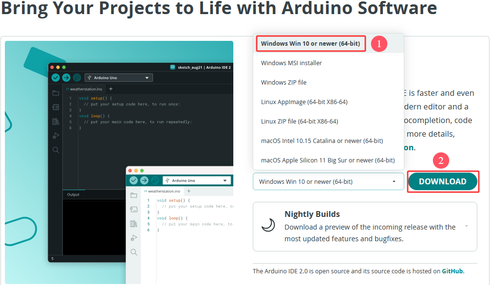

这里我们以Windows系统的为例给大家介绍下载和安装的步骤。Windows系统的也有两个版本，一个版本是安装版：Windows Win 10 or newer(64-bit) ；另一个是下载版：Windows ZIP file，是不用安装，直接下载文件到电脑，解压缩就可以用了。

## 3.2.1 Arduino IDE安装

1\. 保存从软件页面下载的.exe文件到硬盘驱动器，然后简单地运行该文件。

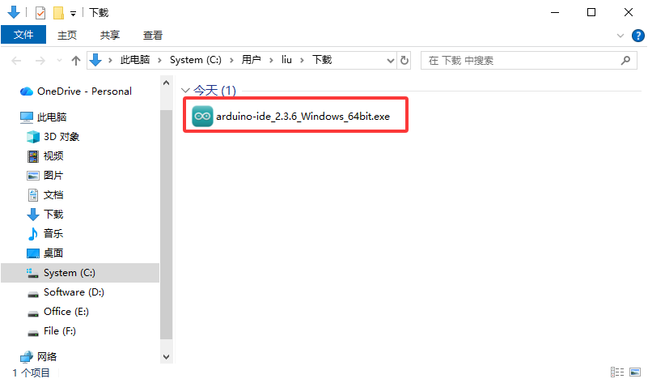

2\. 阅读许可协议并同意。

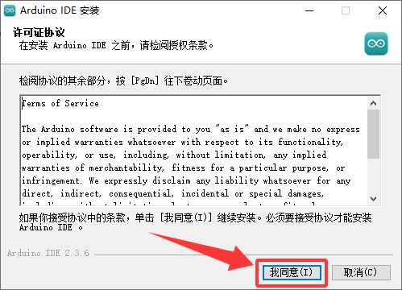

3\. 选择安装选项。

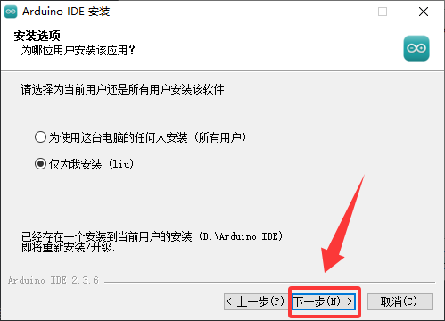

4\. 选择安装位置（选择自己的软件安装路径）。

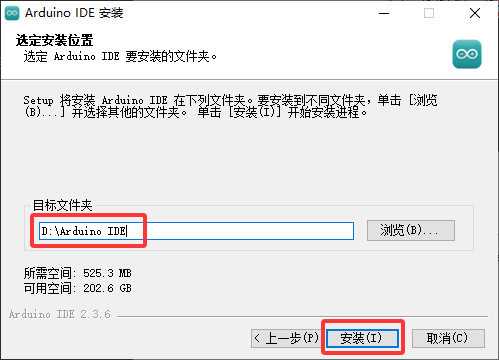

5\. 单击 "完成" 并运行Arduino IDE

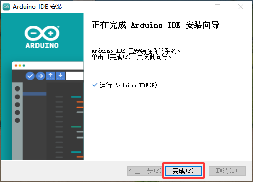

# 3.3 MacOS 系统

## 3.3.1 Arduino IDE下载

我们先到Arduino官方的网站：[Software | Arduino](https://www.arduino.cc/en/software/) 下载 Arduino IDE。

不同的系统，需要下载不同的Arduino IDE，下载方式和Windows类似。这里是以下载 **macOS Intel 10.15 Catalina or newer(64-bit)** 为例，你也可以根据自己所需，选择下载 **macOS Apple Silicon 11 Big Sur or newer(64-bit)**。选择如下图。


## 3.3.2 Arduino IDE安装

Arduino IDE下载之后，双击下载的`arduino_ide_xxxx.dmg`文件并按照说明将 **Arduino IDE.app** 复制粘贴到 **Applications** 文件夹，几秒钟后您将看到 Arduino IDE 安装成功。


# 3.4 设置Arduino IDE语言

⚠️ **特别提醒：Windows系统、MAC系统等不同系统，arduino IDE语言设置方法差不多，可以参考。**

1\. 首先打开Arduino IDE.


2\. 点击“**File** ——>**Preferences...**”，在**Preferences**对话框中，单击 “**中文(简体)**” 按钮你可以选择你习惯的语言然后单击 “**OK**”.

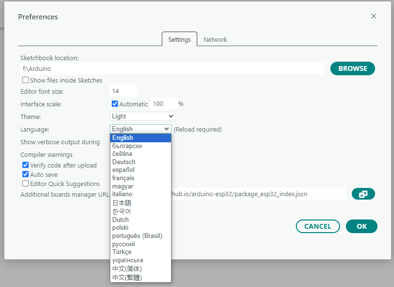

# 3.5 Arduino IDE 页面说明

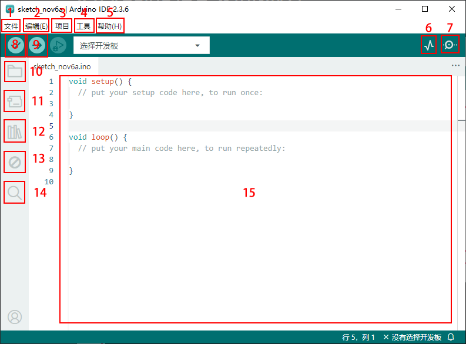

1. “文件”列表里面的功能有新建项目，打开程序，打开最近使用的代码，打开示例代码，关闭IDE，保存代码，首选项，高级设置等。
2. “编辑(E)”列表里面的功能有复制，粘贴，自动格式化，字体大小等这个一般都是使用快捷键进行操作。（建议坚持使用快捷键，接触多了就水到渠成了）
3. “项目”列明里面的常用功能有验证\编译代码，上传代码，导入库等。
4. “工具”列表里面的常用功能有开发板选择，端口选择，这两个很重要
5. “帮助(H)”点击这个可以查看IDE版本已经官方的参考文件
6. “串口绘图仪”它会将串口的数据以折线图的样式显示出来
7. “串口监视器”可以将我们需要查看的数据在这里进行打印显示
8. 验证程序按钮
9. 验证并上传程序按钮
10. “项目文件夹”可以新建项目，还可以只有arduino Cloud进行同步和编辑
11. “开发板管理器”可以添加或删除开发板
12. “库管理”就要添加和删除库
13. “调试”可以对代码进行监视与断点调试
14. 搜索框
15. 代码编辑区

至此Arduino IDE说明教程结束了，请学习如何给Arduino IDE添加库文件，如果没有添加库文件IDE会报错。

# 3.6 在Arduino IDE安装ESP32（重要）

在Arduino IDE上安装ESP32，请执行以下步骤：
(1)点击电脑桌面上的图标，打开Arduino IDE。
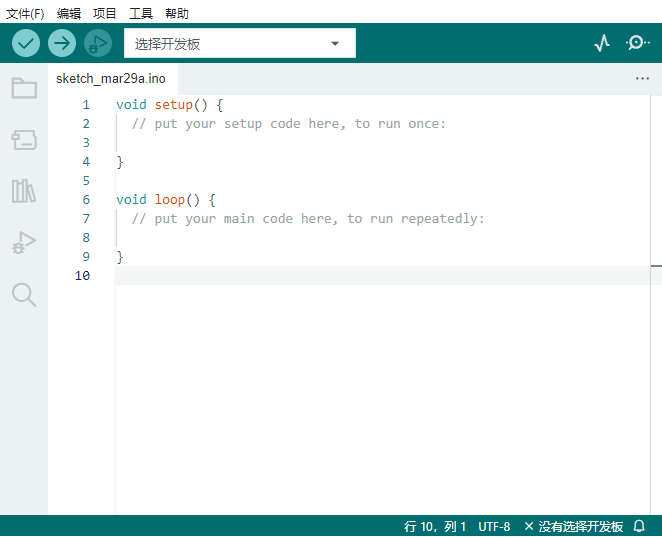
(2)点击“文件” →“首选项”，如下图：
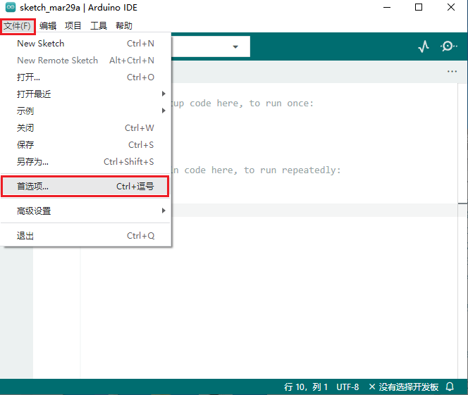
(3)打开下图标出的按钮
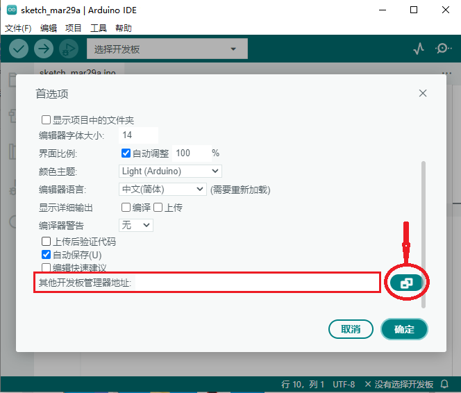
(4)将这个地址：`https://dl.espressif.com/dl/package_esp32_index.json` ，复制粘贴到里面去再点击“**确定**”保存这个地址，如下图：
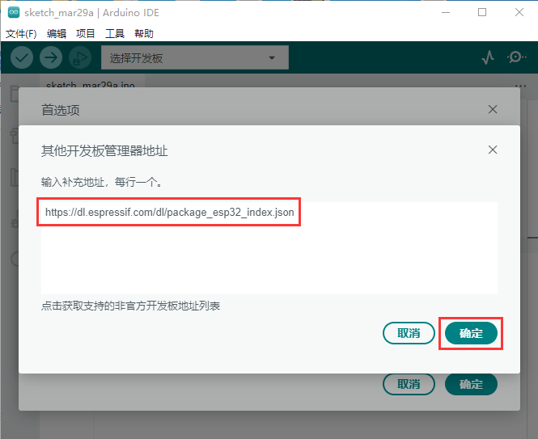
(5)再点击“**确定**”。
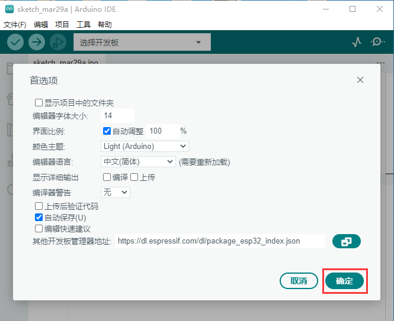
（6）先点击“**工具**”→“**开发版:**”，，再点击“**开发版管理器...**”进入“**开发版管理器**”页面，在文本框中输入“**esp32**”，选择最新版本进行安装，安装包不大，点击“**安装**”开始安装相关安装包。如下图。
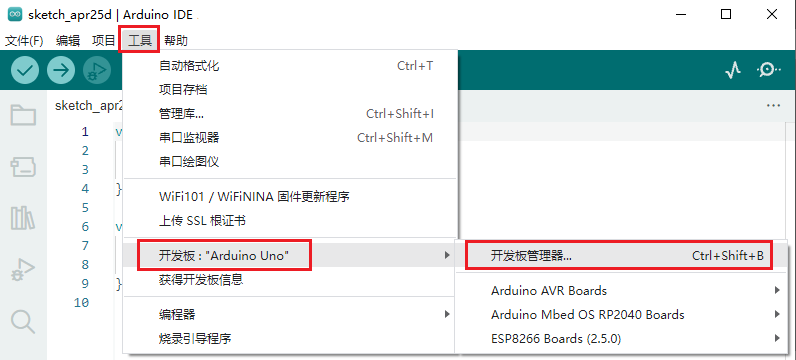
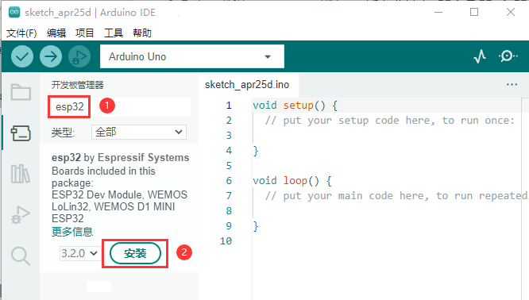
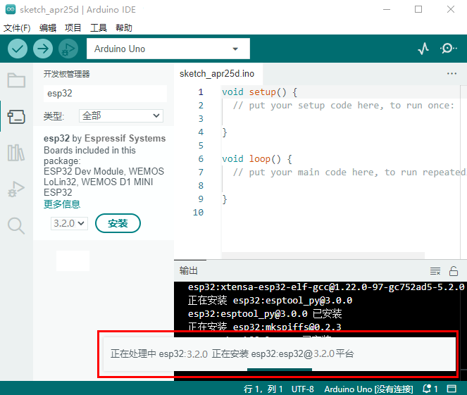 
（7）点击“**工具**”→“**开发版:**”，就可以看到安装好的ESP32 Arduino，你可以在里面查看到各种不同型号ESP32开发板，选择对应的ESP32开发板型号。
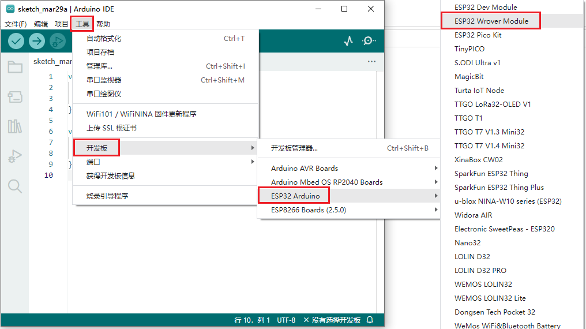
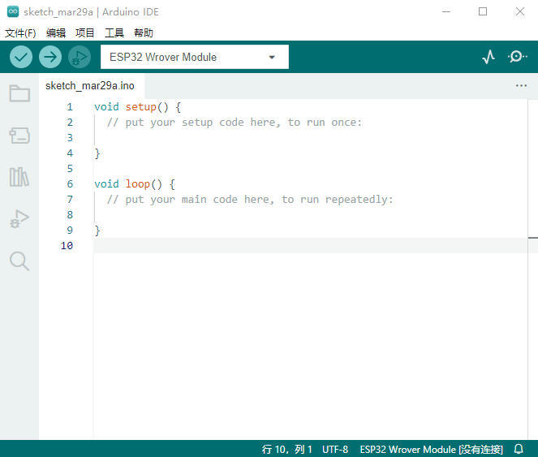
（8)设置好板型后，再选择正确的COM口（安装驱动成功后可看到对应C

# 3.7 给Arduino IDE安装库文件(**重要**)

⚠️ **特别提醒：Windows系统、MAC系统等不同系统，安装库文件的方法差不多，可以相互参考；这里是以Windows系统为例。**

## 3.7.1 什么是库文件

库是代码的集合，使您可以轻松地读取或控制传感器模块执行你想要的功能。

在编译代码或上传代码时，如果出现报错信息 “No such file or directory”，那说明缺少相应的库文件，如下图就是上传代码时因为缺少了库文件的报错。

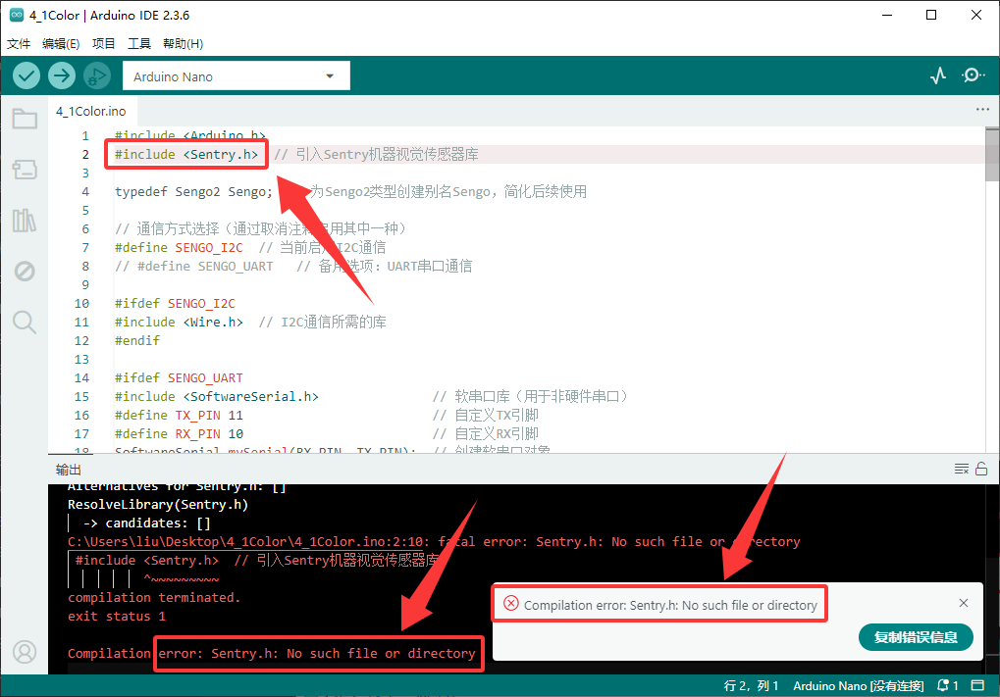


## 3.7.2 如何安装库文件

在这里，我们将为您介绍最简单的添加库的方法。我们是以添加“Sentry”库文件为例。

1\. 首先，依次点击左上角的 **“项目” --> “导入库” --> “添加.ZIP 库...”**

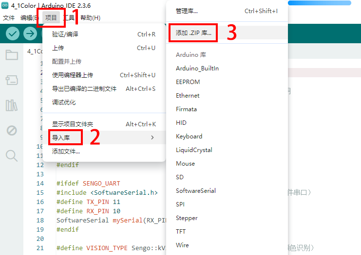

2\. 导航到库文件所在的目录（在`1.代码和库文件下载`中下载的ZIP文件解压），打开文件`lib`然后选择`Sentry-Arduino-1.3.9.zip`文件。

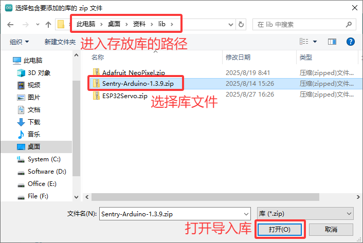

3\. 安装完成后，你将收到一条通知(`Sentry-Arduino-1.3.9.zip`存档成功安装库)，同时输出框会显示 “**Library installed**”，确认该库已成功添加到Arduino IDE中。下次需要使用此库时，你不需要重复安装过程。

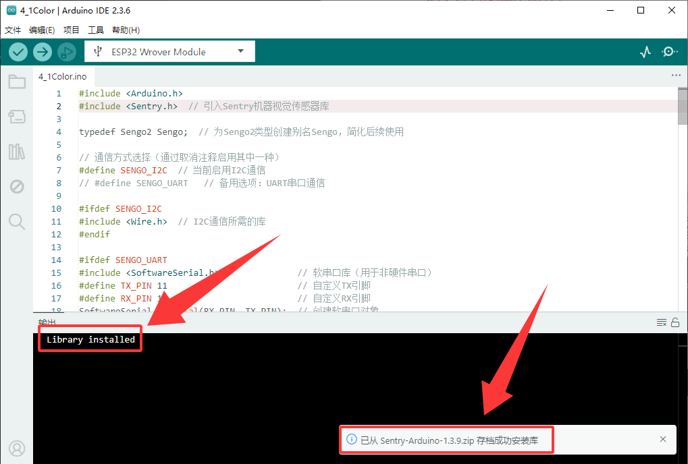

4\. 所有库文件的安装方式都是一样的，你只需按照这个步骤逐个安装库文件即可。

# 3.8 使用Arduino IDE上传第一个程序

先将ESP32开发板通过USB线连接到电脑。

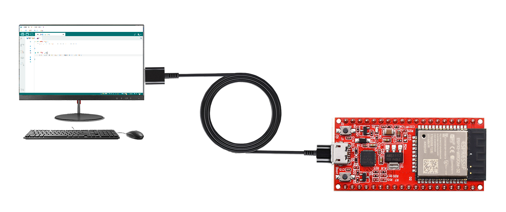

打开Arduino IDE, 选择对应的ESP32开发板型号。


选好开发板后，选择开发板的COM口，开发板安装完驱动后会显示一个COM端口，如果你不知道是哪个，可以进入你电脑的设备管理器中进行查看，如下图：（如果你有很多COM端口，你不知道是哪个就可以拔掉ESP32开发板看哪个消失了，然后再插上ESP32开发板消失的COM口又会显示出来，如果没有COM就请检查是否有安装好开发板驱动）


从图中可知我们的COM端口是COM7，我们在 “**工具**” 列表中选择 “**端口**” 然后选择 “COM7”。

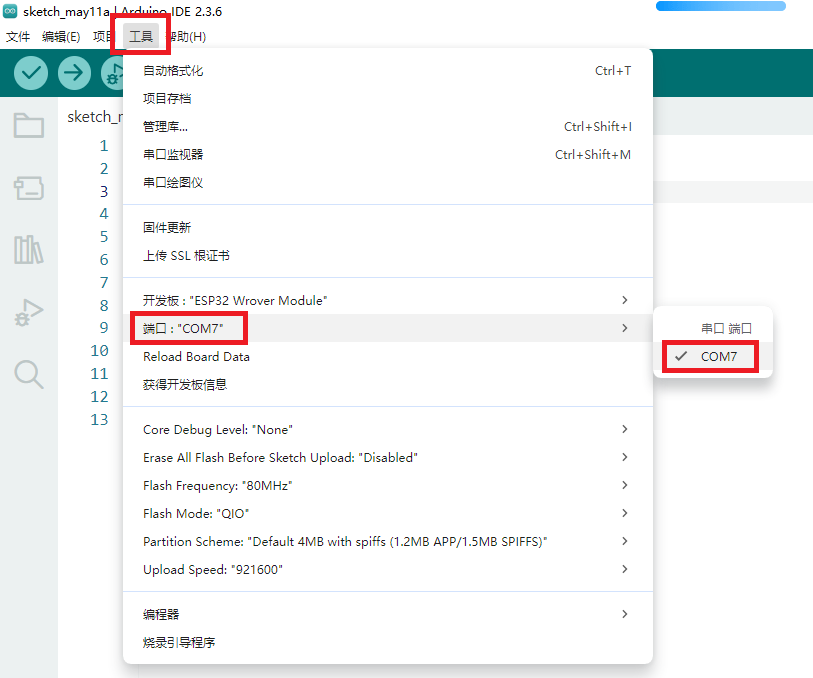

连接上开发板后，这两个地方都会显示已连接的标志，然后添加代码：这里我们提供一个示例代码，代码功能是在串口监视器中每隔一秒钟打印一次“Hello Keyes!”

点击`文件`-->`新建项目`然后将下面的代码复制粘贴到arduino IDE的代码区

```c
/*
  keyes 
  “Hello Keyes!”
  http://www.keyesrobot.com
*/
void setup() {  
    Serial.begin(9600);
}

void loop() {  
    Serial.println("Hello Keyes!");
 	delay(1000); 
}
```

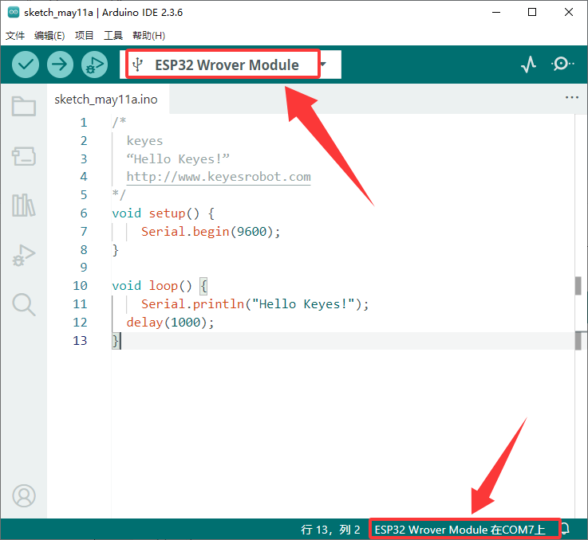

然后我们点击编译并上传代码，上传成功后IDE也会有两个提示，如图：

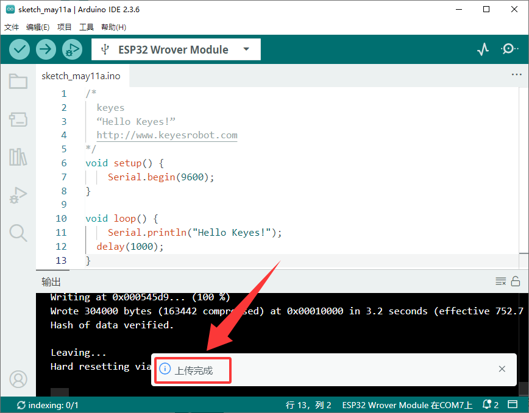

然后我们点击右上角的“串口监视器”图标便能打开串口监视器，然后设置波特率为**9600**，就能看到串口打印字符串 “**Hello Keyes!**”

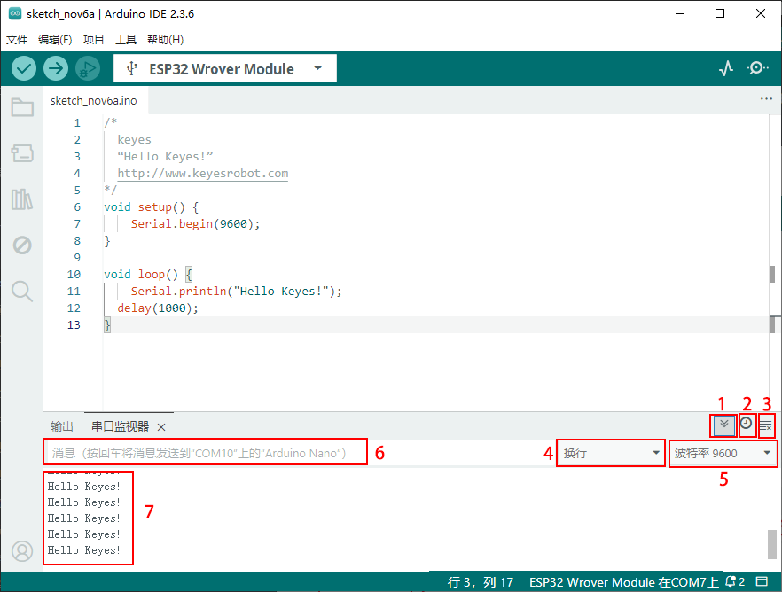

1\. “切换自动滚动”：设置打印窗口是否跟随打印.

2\. “切换时间戳 ”：设置是否显示打印时间。

3\. “清除输出 /清空输出”：清除打印窗口中的数据。

4\. 串口输入框。

5\. 串口发送格式。

6\. 设置波特率，点击即可选择需要的波特率。

7\. 打印窗口。


# 3.9 Arduino基础代码介绍

更多详细解释请参考官方链接：[Language Reference | Arduino Documentation](https://docs.arduino.cc/language-reference/)
