# 2.1 Windows系统USB驱动安装

 检查CP2102驱动是否已经安装

1. 用USB线连接计算机和ESP32。
   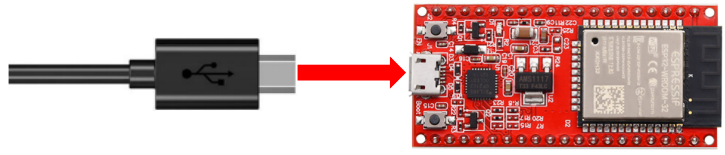

2. 进入计算机主界面，选择“**此电脑**”，右键单击选择“**管理**”。

   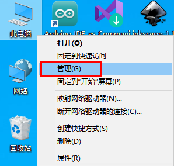

3.单击“**设备管理器**”。如果你的计算机已经安装了CP2102驱动，则可以看到“**Silicon Labs CP210x USB to UART Bridge(COMx)**”。

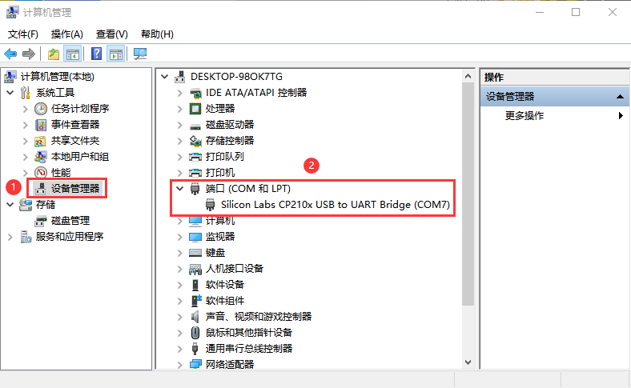

 安装CP2102驱动

1. 如果未安装CP2102驱动，界面显示如下。

   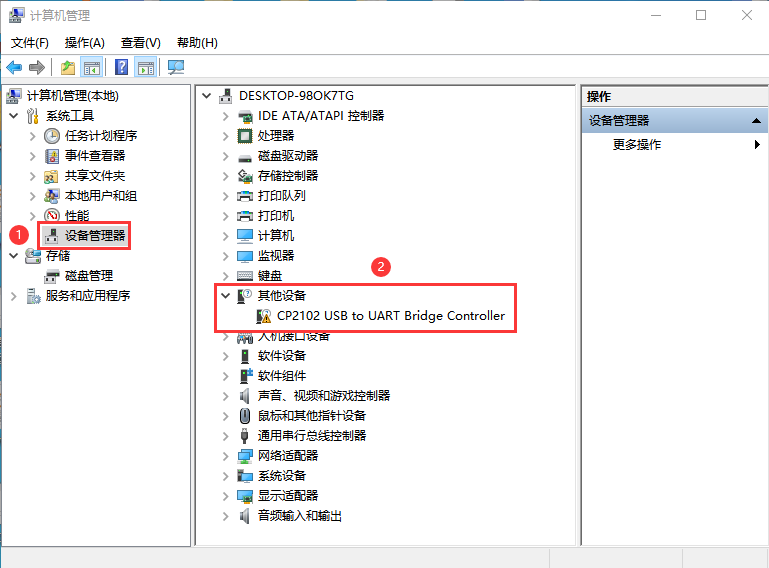

2.单击“**CP2102 USB to UART Bridge Controller**”，右键选择“**更新驱动程序(P)**”。

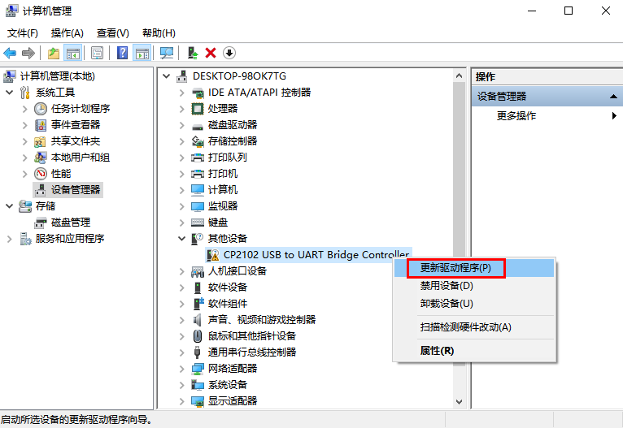

3.单击“**浏览我的电脑以查找驱动程序(R) **”.

4.单击“浏览(R)...”选择CP210x_6.7.4(驱动路径：资料\USB驱动\CP2102 驱动文件-Windows\CP210x_6.7.4)，单击“**下一页**”

5. 等待CP2102驱动安装完成。当界面显示如下时，表示已安装CP2102驱动。你可以关闭该界面。

   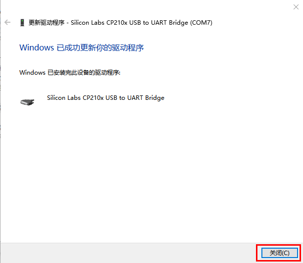

6.ESP32与计算机连接时，界面显示如下。

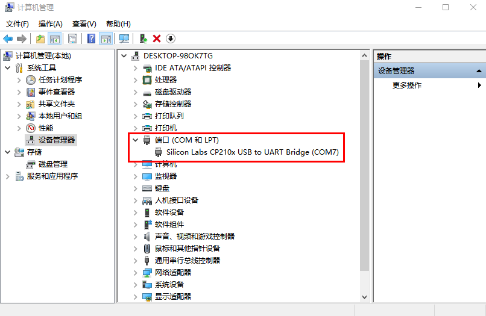

# 2.2 MAC系统USB驱动安装

按照路径打开文件夹`资料\USB驱动\CP2102 驱动文件-MAC\macOS_VCP_Driver`，双击“SiLabsUSBDriverDisk.dmg”文件。

可以看到以下文件。

双击“Install CP210x VCP Driver”，勾选“Don’t warn me when opening application on this disk image”并单击“Open”。

单击“Continue”。

先点击“Agree”，然后点击“Continue”。

继续点击“Continue”，然后输入你的用户密码

选择“Select Open Security Preferences”。

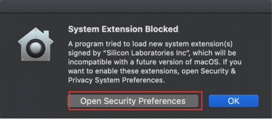

点击安全锁，输入你的用户密码来授权。

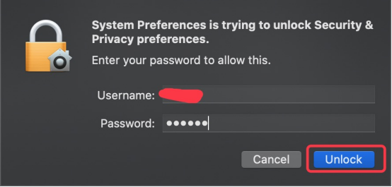

看到锁被打开了，点击“Allow”。

回到安装界面，根据提示等待安装.

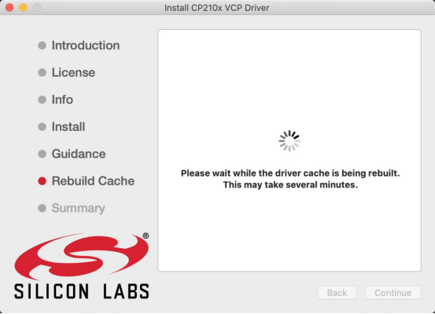

安装成功

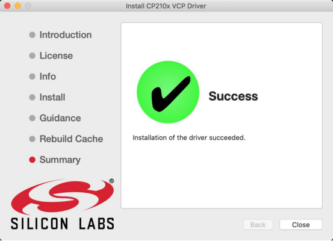

