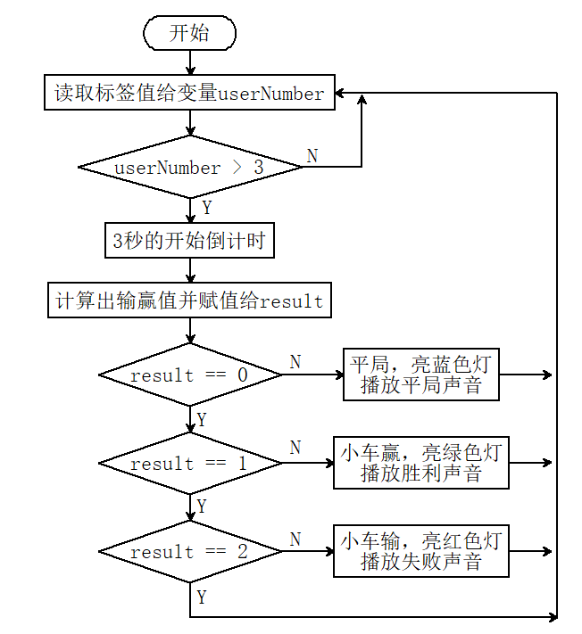

# 5.5 标签石头剪刀布

## 5.5.1 简介

标签石头剪刀布，使用16h5标签的0（石头），1（剪刀），2（布）代表手势的石头剪刀布与小车进行输赢比赛，小车会随机生成0（石头），1（剪刀），2（布），如果小车赢了小车会发出胜利的声音并亮绿灯，如果小车输了小车会发出失败的声音并亮红灯，如果是平局则发出平局的声音并亮蓝灯。

## 5.5.2 流程图



## 5.5.3 代码

```python
from machine import I2C,UART,Pin,PWM
from Sengo2 import *
import time
import random
import neopixel

# 等待Sengo2完成操作系统的初始化。此等待时间不可去掉，避免出现Sengo2尚未初始化完毕主控器已经开发发送指令的情况
time.sleep(3)

# 选择UART或者I2C通讯模式，Sengo2出厂默认为I2C模式，短按模式按键可以切换
# 4种UART通讯模式：UART9600（标准协议指令），UART57600（标准协议指令），UART115200（标准协议指令），Simple9600（简单协议指令），
#########################################################################################################
# port = UART(2,rx=Pin(16),tx=Pin(17),baudrate=9600)
i2c = I2C(0,scl=Pin(22),sda=Pin(21),freq=400000)

# Sengo2通讯地址：0x60。如果I2C总线挂接多个设备，请避免出现地址冲突
sengo2 = Sengo2(0x60)
 
err = sengo2.begin(i2c)
print("sengo2.begin: 0x%x"% err)

# 选择编码格式，默认36H11。如果需要在程序运行过程中切换编码格式，请先关闭Apriltag算法，设置完毕编码格式后再开启算法
#sengo2.VisionSetMode(sengo2_vision_e.kVisionAprilTag, apriltag_vision_mode_e.kVisionModeFamily36H11)
#sengo2.VisionSetMode(sengo2_vision_e.kVisionAprilTag, apriltag_vision_mode_e.kVisionModeFamily25H9)
sengo2.VisionSetMode(sengo2_vision_e.kVisionAprilTag, apriltag_vision_mode_e.kVisionModeFamily16H5)
time.sleep(1)
 
# 1、Apriltag与二维码不同，请勿混淆。二者在使用时，周围一圈均需要留白；
# 2、sengo2可以同时运行多个算法，但有限制要求
# 3、Sengo系列产品参数与结果的编号都是从1开始；
# 4、正常使用时，应由主控器发送指令控制Sengo2算法的开启与关闭，而非通过摇杆手动进行操作；
err = sengo2.VisionBegin(sengo2_vision_e.kVisionAprilTag)
print("sengo2.VisionBegin(sengo2_vision_e.kVisionAprilTag):0x%x"% err)

#Initialize the passive buzzer
buzzer = PWM(Pin(2, Pin.OUT))
buzzer.freq(1000)     # 设置默认频率
time.sleep(0.001)
buzzer.duty_u16(0)		# 确保启动时蜂鸣器是关闭的

#Define the number of pin and LEDs connected to neopixel.
pin = Pin(14, Pin.OUT)
np = neopixel.NeoPixel(pin, 4)

# 变量定义
brightness = 100
color_red = 0
color_green = 1
color_blue = 2
color_white = 3
color_off = 4

colors = [
    (brightness, 0, 0),                    # 红
    (0, brightness, 0),                    # 绿
    (0, 0, brightness),                    # 蓝
    (brightness, brightness, brightness),  # 白
    (0, 0, 0)                              # 关闭
]

def set_ws2812_color(color):
    for j in range(4):
        np[j] = colors[color] # 绿
    np.write()
    
set_ws2812_color(color_off)

def tone(pin, frequency, duration):
    """播放指定频率的声音"""
    if frequency > 0:
        pin.freq(frequency)
        pin.duty_u16(32768)  # 50%占空比
    time.sleep_ms(duration)
    pin.duty_u16(0)  # 停止声音

def no_tone(pin):
    """停止声音"""
    pin.duty_u16(0)

def countdown(seconds):
    """倒计时音效"""
    for i in range(seconds, 0, -1):
        # 倒计时滴答声
        tone(buzzer, 800, 100)
        time.sleep_ms(200)
        no_tone(buzzer)
        
        # 间隔时间
        time.sleep_ms(500)

def play_start_sound():
    """游戏开始音效"""
    # 上升音阶+结束音
    tones = [
        (523, 100),  # C5
        (659, 100),  # E5
        (784, 100),  # G5
        (1046, 300)  # C6高音
    ]
    
    for freq, dur in tones:
        tone(buzzer, freq, dur)
        time.sleep_ms(120)  # 音符间隔
    
    no_tone(buzzer)
    time.sleep_ms(350)

def victory_sound():
    """胜利音效"""
    tones = [
        (587, 150),  # D5
        (784, 100),  # G5
        (1046, 200)  # C6
    ]
    
    delays = [200, 120, 250]
    
    for (freq, dur), dly in zip(tones, delays):
        tone(buzzer, freq, dur)
        time.sleep_ms(dly)
    
    no_tone(buzzer)

def defeat_sound():
    """失败音效"""
    tones = [
        (220, 400),  # A3
        (196, 600)   # G3
    ]
    
    delays = [500, 700]
    
    for (freq, dur), dly in zip(tones, delays):
        tone(buzzer, freq, dur)
        time.sleep_ms(dly)
    
    no_tone(buzzer)

def draw_sound():
    """平局音效"""
    for _ in range(3):
        tone(buzzer, 349, 80)  # F4
        time.sleep_ms(100)
        tone(buzzer, 330, 80)  # E4
        time.sleep_ms(100)
    no_tone(buzzer)

gesture = ["石头","剪刀","布  "]

while True:
    # Sengo2不主动返回检测识别结果，需要主控板发送指令进行读取。读取的流程：首先读取识别结果的数量，接收到指令后，Sengo2会刷新结果数据，如果结果数量不为零，那么主控再发送指令读取结果的相关信息。请务必按此流程构建程序。
    obj_num = sengo2.GetValue(sengo2_vision_e.kVisionAprilTag, sentry_obj_info_e.kStatus)
    #随机生成0-2之间的数
    randomNumber = random.randint(0,2)
    
    if obj_num:
            #获取标签编号
            userNumber = sengo2.GetValue(sengo2_vision_e.kVisionAprilTag, sentry_obj_info_e.kLabel, 1)
            if userNumber < 3:
                set_ws2812_color(color_off)
                result = (userNumber - randomNumber + 3) % 3
                countdown(3)
                play_start_sound()
                print(f"机器人:{gesture[randomNumber]}  人:{gesture[userNumber]}  机器人说:",end='')
                if result == 0:
                    print("平局")
                    draw_sound()
                    set_ws2812_color(color_blue)
                elif result == 1:
                    print("我赢了")
                    set_ws2812_color(color_green)
                    victory_sound()
                elif result == 2:
                    print("我输了")
                    set_ws2812_color(color_red)
                    defeat_sound()
                # 关闭蜂鸣器
                no_tone(buzzer)
                
                


```

## 5.5.4 代码结果

上传代码成功后，AI视觉模块会对拍到的画面进行识别，判断是否有16h5类型的标签，如果有则将标签值传输给开发板。我们可以随机将标签值为“0，1，2”的卡片放到摄像头识别区与小车进行猜拳，如果是平局小车会亮蓝色灯并发出平局的音效，如果是小车赢了那么小车会亮绿灯并发出胜利了的音效，如果是小车输了那么小车会亮红灯并发出失败了的音效。
